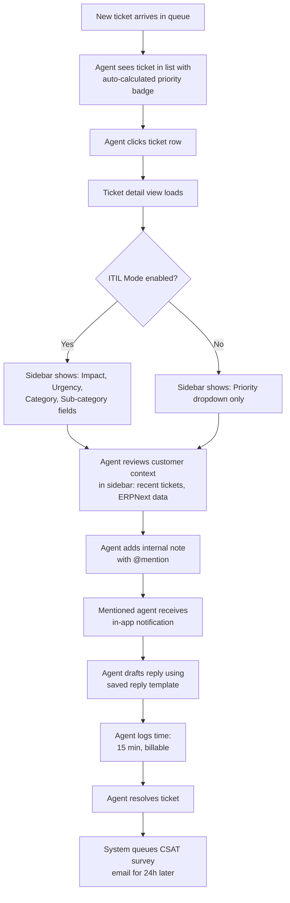
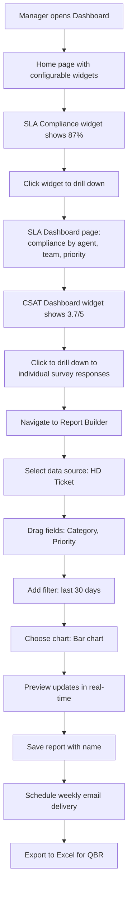
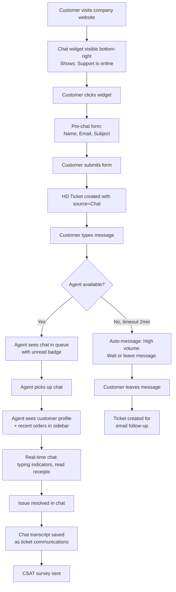
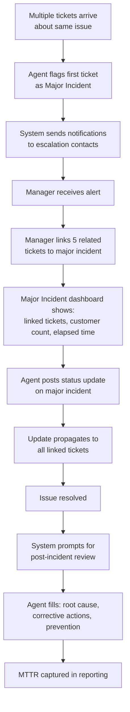
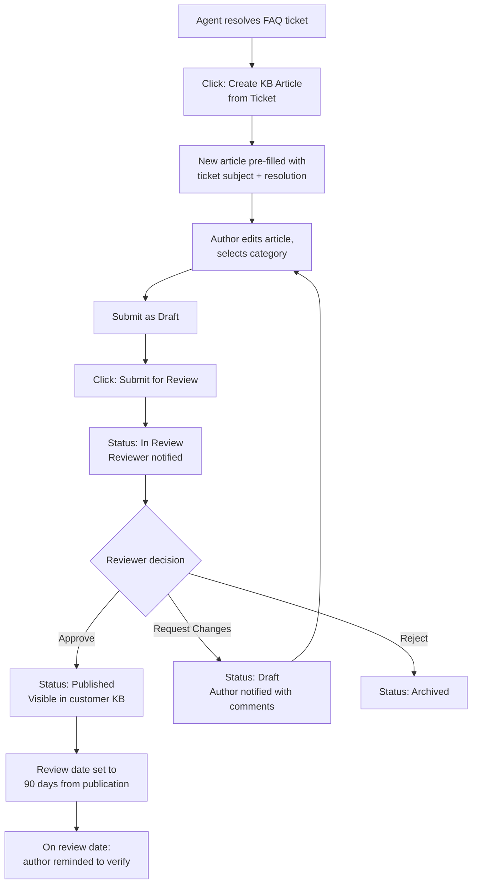
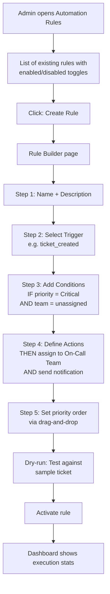

# UX Design Specification: Frappe Helpdesk Phase 1

## 1. Design Vision & Principles

### 1.1 Design Vision

Frappe Helpdesk Phase 1 transforms a basic ticketing tool into a professional, ITIL-aligned support platform without sacrificing the simplicity that makes open-source tools appealing. The design must feel as polished as Freshdesk while remaining as approachable as Help Scout.

### 1.2 Experience Principles

1. **Progressive Disclosure Over Overwhelm** -- ITIL fields (impact, urgency, category) are hidden by default in "Simple Mode." Only teams that need ITIL complexity enable it. The UI never punishes basic users with enterprise clutter.

2. **Speed is a Feature** -- Agents handle 30-50 tickets daily. Every interaction must be optimized for keyboard-driven workflows. Target: zero-mouse ticket triage for power users via existing shortcuts (T, P, A, S, R, C, Ctrl+K).

3. **Context Without Context-Switching** -- Customer history, related tickets, KB articles, and time tracking all live in the ticket sidebar. Agents never leave the ticket view to find information.

4. **Consistent Patterns, Not Consistent Monotony** -- All list views use `ListViewBuilder`, all detail views use header + content + sidebar layout, all forms use frappe-ui components. But each portal (Agent, Customer, Admin) has a distinct visual identity through color and density.

5. **Accessible by Default** -- WCAG 2.1 AA compliance. All new components support keyboard navigation. No mouse-only interactions. Color is never the sole indicator of state.

### 1.3 Design System Foundation

**Framework:** frappe-ui (Vue 3) -- the existing component library used throughout the codebase.

**Key frappe-ui Components Already in Use:**
- `Button`, `Badge`, `Tooltip`, `Dropdown`, `FeatherIcon` -- atomic UI elements
- `FormControl`, `TextEditor` -- form inputs
- `ListView` / `ListViewBuilder` -- all list pages (tickets, KB, contacts)
- `createResource`, `createListResource` -- data fetching pattern
- `toast` -- notifications
- `usePageMeta` -- page title management

**Icon System:** Lucide icons (`LucidePlus`, `LucideSearch`, `LucideBell`, etc.) via direct import.

**Styling:** Tailwind CSS utility classes. Gray-50 sidebar backgrounds, gray-200 borders, gray-900 text. Consistent spacing with `p-2`, `gap-2`, `my-0.5` patterns.

**Layout Pattern:** All pages follow `LayoutHeader` (breadcrumbs left, actions right) + content area pattern. Agent portal uses `DesktopLayout` (sidebar + main) / `MobileLayout` responsive switch.

---

## 2. Portal Architecture

### 2.1 Portal Overview

Frappe Helpdesk serves three distinct portals, each with tailored information density and navigation:

| Portal | Users | Route Prefix | Layout | Primary Color |
|--------|-------|-------------|--------|--------------|
| **Agent Portal** | Support agents, KB authors | `/helpdesk/` | DesktopLayout (sidebar + main) | Blue/Gray (current) |
| **Customer Portal** | End customers | `/helpdesk/my-tickets` | CustomerPortalRoot (simplified) | Brand-configurable |
| **Admin Portal** | Admins, managers | `/helpdesk/` (settings routes) | DesktopLayout + Settings layout | Same as Agent |

### 2.2 Agent Portal

**Current Structure (preserved):**
- Left sidebar: User menu, Search (Ctrl+K), Dashboard, Notifications, ticket views, KB, Customers, Contacts
- Main area: Content with `LayoutHeader` + body pattern
- Ticket detail: Header + activity panel (left) + sidebar (right) with resizer

**Phase 1 Additions to Sidebar Navigation:**
| New Item | Icon | Position | Condition |
|----------|------|----------|-----------|
| Live Chat Queue | `LucideMessageCircle` | Below Notifications | When chat enabled |
| Reports | `LucideBarChart3` | Below KB | Always |
| Automations | `LucideZap` | Settings section | Admin role only |

### 2.3 Customer Portal

**Current Structure (preserved):**
- Simplified layout without agent sidebar
- Routes: `/my-tickets`, `/my-tickets/:ticketId`, `/my-tickets/new`, `/kb-public`

**Phase 1 Additions:**
- Live chat widget overlay (bottom-right, not a route)
- CSAT survey response page (linked from email)
- Brand-specific theming (logo, primary color from HD Brand DocType)

### 2.4 Admin Portal

Admin features are accessed through existing Settings routes within the Agent Portal. No separate admin application.

**Phase 1 New Settings Pages:**
| Page | Route | Purpose |
|------|-------|---------|
| Automation Rules | `/helpdesk/automation-rules` | Visual rule builder |
| SLA Configuration | `/helpdesk/sla` (enhanced) | Business hours, holidays, breach alerts |
| CSAT Settings | `/helpdesk/csat-settings` | Survey templates, frequency |
| Brand Management | `/helpdesk/brands` | Multi-brand configuration |
| ITIL Settings | `/helpdesk/itil-settings` | Simple/ITIL mode toggle, priority matrix |

---

## 3. User Flows

### 3.1 UJ-01: Agent Handles Ticket with ITIL Context



**Screen-by-Screen:**

1. **Ticket List** (`/helpdesk/tickets`) -- Existing `ListViewBuilder` with new columns:
   - Priority badge with color coding (P1=red, P2=orange, P3=yellow, P4=blue, P5=gray)
   - Category pill (if ITIL mode)
   - SLA countdown indicator (color-coded: green > yellow > orange > red)

2. **Ticket Detail** (`/helpdesk/tickets/:ticketId`) -- Existing layout extended:
   - **Activity Panel** (left): New "Internal Note" tab alongside Reply and Comment. Internal notes have amber/yellow background, lock icon, "Internal Note" badge. @mention autocomplete triggers on `@` character in note editor.
   - **Sidebar** (right): New collapsible sections for ITIL fields, time tracking, related tickets, linked KB articles.

### 3.2 UJ-02: Manager Reviews Team Performance



**Screen-by-Screen:**

1. **Home Dashboard** (`/helpdesk/home`) -- Existing editable dashboard. New widget types:
   - **SLA Compliance Widget**: Gauge/percentage display, color-coded. Click drills to SLA dashboard.
   - **CSAT Score Widget**: Star rating average with trend arrow. Click drills to CSAT dashboard.
   - **Time Tracking Summary Widget**: Average resolution effort, billable ratio.

2. **SLA Dashboard** (`/helpdesk/dashboard/sla`) -- New page:
   - Top bar: Date range picker, team filter, priority filter
   - Row 1: Overall compliance %, response compliance %, resolution compliance % (large number cards)
   - Row 2: Compliance trend line chart (daily/weekly/monthly toggle)
   - Row 3: Compliance by agent table with sparklines
   - Row 4: Breach analysis -- top categories, time-of-day heatmap

3. **CSAT Dashboard** (`/helpdesk/dashboard/csat`) -- New page:
   - Top bar: Date range picker, team filter, agent filter
   - Row 1: Overall CSAT score (large), response rate %, rating distribution bar chart
   - Row 2: Score trend line chart over time
   - Row 3: Score by agent table
   - Row 4: Recent negative feedback (1-2 stars) with ticket links

4. **Report Builder** (`/helpdesk/reports/new`) -- New page:
   - Left panel: Data source selector (HD Ticket, HD CSAT Response, HD Time Entry, HD Article)
   - Center: Drag-and-drop field chips, filter builder, group-by selector
   - Right: Live preview pane with chart type toggle (bar/line/pie/table)
   - Footer: Save, Schedule, Export buttons

### 3.3 UJ-03: Customer Gets Help via Live Chat



**Screen-by-Screen:**

1. **Chat Widget** (embedded JS, external websites):
   - Collapsed state: Circular button, bottom-right, brand color, chat icon, availability dot (green/amber/gray)
   - Expanded state: 400px wide panel (desktop) / full-screen (mobile)
   - Header: Brand logo, "Support" title, availability status text, minimize button
   - Body: Message list with bubbles (customer right-aligned blue, agent left-aligned gray)
   - Typing indicator: Three animated dots when agent is typing
   - Footer: Text input, attachment button (paperclip), send button
   - Pre-chat form: Name, Email, Subject fields with "Start Chat" button. Fields configurable as required/optional/hidden.

2. **Agent Chat Interface** (within Agent Portal):
   - **Chat Queue Panel**: New sidebar section or tab showing active chats with:
     - Customer name, subject preview, unread count badge, wait time
     - Agent availability toggle: Online / Away / Offline dropdown at top
   - **Chat Conversation View**: Reuses existing `CommunicationArea` patterns:
     - Message bubbles with timestamps
     - Typing indicator component (already exists: `TypingIndicator.vue`)
     - Message status: sent (single check), delivered (double check), read (blue double check)
     - Transfer button: hand-off chat to another agent/team
     - "Convert to Email" action for follow-up

### 3.4 UJ-04: Agent Manages Major Incident



**Screen-by-Screen:**

1. **Major Incident Flag** (on Ticket Detail):
   - Checkbox in sidebar "ITIL" section: "Major Incident" with warning icon
   - When checked: Confirmation dialog "This will notify escalation contacts. Continue?"
   - Ticket header changes: Red banner "MAJOR INCIDENT" with elapsed time counter

2. **Major Incident Dashboard** (`/helpdesk/major-incidents`):
   - Active major incidents as cards: title, severity, elapsed time, linked ticket count, affected customer count
   - Click card to open major incident ticket detail
   - Timeline of status updates across all linked incidents

3. **Post-Incident Review** (on Ticket Detail, after resolution):
   - Expandable section appears: "Post-Incident Review"
   - Fields: Root Cause Summary (textarea), Corrective Actions (textarea), Prevention Measures (textarea)
   - Required before ticket can be fully closed (configurable)

### 3.5 UJ-05: KB Author Manages Article Lifecycle



**Screen-by-Screen:**

1. **Article Editor** (`/helpdesk/articles/new/:id` -- existing, enhanced):
   - Top: Title input, Category dropdown, Sub-category dropdown
   - New fields in sidebar: Status badge (Draft/In Review/Published/Archived), `internal_only` checkbox, review date picker, linked tickets list
   - Action buttons change by state:
     - Draft: "Submit for Review" (primary), "Save Draft" (secondary)
     - In Review: "Approve" / "Request Changes" / "Reject" (reviewer only)
     - Published: "Edit" (creates new draft version), "Archive"

2. **Article List** (`/helpdesk/kb` -- existing `ListViewBuilder`, enhanced):
   - New columns: Status badge (color-coded), Review Date, Version count
   - New filters: Status, Internal Only, Review Due
   - Row action: "View Versions" opens version history drawer

3. **Articles Due for Review** (Dashboard widget):
   - List of articles past review date, sorted by most overdue
   - Quick actions: "Mark Reviewed", "Edit", "Archive"

### 3.6 UJ-06: Admin Configures Workflow Automation



**Screen-by-Screen:**

1. **Automation Rule List** (`/helpdesk/automation-rules`):
   - `ListViewBuilder` with columns: Name, Trigger, Status (enabled/disabled toggle), Executions (count), Last Fired
   - Row actions: Edit, Duplicate, Disable/Enable, Delete
   - "Create Rule" button (top right)

2. **Rule Builder** (`/helpdesk/automation-rules/new`):
   - **Trigger Section**: Dropdown with 10+ trigger types (ticket_created, ticket_updated, ticket_assigned, ticket_resolved, ticket_reopened, sla_warning, sla_breached, csat_received, chat_started, chat_ended). Each shows a description tooltip.
   - **Conditions Section**: Uses existing `conditions-filter` component pattern. Each condition row: Field dropdown > Operator dropdown > Value input. AND/OR group toggle. "Add Condition" / "Add Group" buttons.
   - **Actions Section**: Each action row: Action type dropdown > configuration fields. Action types: assign_to_agent, assign_to_team, set_priority, set_status, set_category, add_tag, send_email, send_notification, add_internal_note, trigger_webhook. "Add Action" button.
   - **Footer**: "Save", "Test Rule" (dry-run modal), "Save & Enable"

3. **Dry-Run Modal**:
   - Ticket selector: search and pick a ticket to test against
   - Results: "Conditions matched: Yes/No", "Actions that would execute: [list]"
   - No actual changes made during dry-run

---

## 4. Wireframe Descriptions

### 4.1 Ticket Detail View (Enhanced)

```
+------------------------------------------------------------------+
|  [<] Ticket #1234    [Amara viewing] [typing...]    [Resolve v]  |
+------------------------------------------------------------------+
|                                    |                              |
|  [Reply] [Comment] [Internal Note] |  DETAILS                    |
|  --------------------------------- |  Status: [Open v]           |
|                                    |  Priority: [P2 - High]      |
|  +------------------------------+ |  Type: [Incident v]         |
|  | Customer message             | |  Agent: [Amara v]           |
|  | 2026-03-22 10:30 AM          | |  Team: [Tier 1 v]           |
|  +------------------------------+ |                              |
|                                    |  ITIL FIELDS (if enabled)   |
|  +------------------------------+ |  Impact: [High v]           |
|  | [lock] Internal Note         | |  Urgency: [Medium v]        |
|  | @Rajesh - third dispute      | |  Category: [Billing v]      |
|  | this week, flagging.         | |  Sub-cat: [Invoice v]       |
|  | -- amber background --       | |  [ ] Major Incident         |
|  +------------------------------+ |                              |
|                                    |  TIME TRACKING              |
|  +------------------------------+ |  Total: 45m | Billable: 30m |
|  | Agent reply                  | |  [+ Log Time] [Start Timer] |
|  | Hi, I've looked into...      | |                              |
|  +------------------------------+ |  RELATED TICKETS            |
|                                    |  #1230 - Duplicate of       |
|  ================================ |  #1228 - Related to         |
|  | [Rich text editor]          | |  [+ Link Ticket]            |
|  |                             | |                              |
|  | [Send Reply] [Add Note]     | |  KB ARTICLES                |
|  ================================ |  Billing FAQ (Published)     |
|                                    |  [+ Link Article]           |
|                                    |  [Create Article from Ticket]|
|                                    |                              |
|                                    |  CUSTOMER                   |
|                                    |  Maria Chen                 |
|                                    |  Acme Corp                  |
|                                    |  3 recent tickets           |
+------------------------------------------------------------------+
```

### 4.2 Internal Note (Visual Treatment)

```
+--------------------------------------------------+
|  [lock icon] INTERNAL NOTE        Mar 22, 10:45  |
|  ------------------------------------------------|
|  @Rajesh - this is the third invoice dispute      |
|  from this customer this week. Flagging for       |
|  review before we respond.                        |
|                                                   |
|  [attachment.pdf]                                 |
+--------------------------------------------------+
   Background: amber-50 (#FFFBEB)
   Left border: amber-400 (#FBBF24), 3px
   Badge: "Internal Note" in amber-700 on amber-100
   Lock icon: amber-600
```

### 4.3 Time Tracking Section (Ticket Sidebar)

```
TIME TRACKING
+-----------------------------------------+
| Total: 1h 15m  |  Billable: 45m        |
+-----------------------------------------+
| [> Start Timer]     [+ Log Time]        |
+-----------------------------------------+
| 03/22  Amara   30m  Billable  Debugging |
| 03/22  Amara   15m  Non-bill  Research  |
| 03/21  Rajesh  30m  Billable  Escalation|
+-----------------------------------------+
```

**Timer Mode**: Clicking "Start Timer" starts a stopwatch visible in the sidebar. Timer persists across page navigation (stored in localStorage). "Stop" button appears, click to save with description prompt.

**Manual Entry Modal**:
```
+----------------------------------+
|  Log Time                    [X] |
|  --------------------------------|
|  Duration:  [  ] hrs [  ] mins   |
|  Billable:  [x]                  |
|  Description: [_______________ ] |
|                                  |
|  [Cancel]          [Log Time]    |
+----------------------------------+
```

### 4.4 Live Chat Widget (External)

```
Collapsed:                    Expanded (Desktop 400px):
+--------+                    +----------------------------------+
| [chat] |                    |  [Brand Logo]  Support   [--] [X]|
| (dot)  |                    |  Online - typically replies in 2m |
+--------+                    +----------------------------------+
                              |                                  |
                              |  +----------------------------+  |
                              |  | Hi! How can we help today? |  |
                              |  +----------------------------+  |
                              |                                  |
                              |         +--------------------+   |
                              |         | I have a question  |   |
                              |         | about my invoice   |   |
                              |         +--------------------+   |
                              |                                  |
                              |  +----------------------------+  |
                              |  | Sure, let me look into     |  |
                              |  | that for you. Can you      |  |
                              |  | share your order number?   |  |
                              |  +----------------------------+  |
                              |  Agent typing...                 |
                              +----------------------------------+
                              | [clip] Type a message... [Send]  |
                              +----------------------------------+
```

**Widget States:**
- **Online**: Green dot, "Support is online" text
- **Away**: Amber dot, "We'll respond soon" text
- **Offline**: Gray dot, "Leave a message" text, form replaces chat interface

### 4.5 Agent Chat Queue

```
ACTIVE CHATS (3)                     [Online v]
+----------------------------------------------+
| [*] Maria Chen              2m  (2 unread)   |
|     Invoice question                          |
+----------------------------------------------+
| [ ] John Smith              5m               |
|     Shipping delay                            |
+----------------------------------------------+
| [ ] Priya Patel             1m               |
|     Password reset                            |
+----------------------------------------------+
```

Located as a new sidebar section or as a tab within the existing ticket list view. Unread chats show bold text and blue badge count. Active chat indicator (blue dot) shows which chat agent is currently viewing.

### 4.6 Automation Rule Builder

```
+------------------------------------------------------------------+
|  [<] Back to Rules       New Automation Rule       [Test] [Save]  |
+------------------------------------------------------------------+
|                                                                    |
|  Name: [Critical Ticket Auto-Assignment____________]              |
|  Description: [Assigns unassigned critical tickets to on-call]    |
|                                                                    |
|  WHEN (Trigger)                                                    |
|  +--------------------------------------------------------------+ |
|  | [ticket_created v]  When a new ticket is created              | |
|  +--------------------------------------------------------------+ |
|                                                                    |
|  IF (Conditions)                                        [AND v]   |
|  +--------------------------------------------------------------+ |
|  | [Priority v]  [equals v]  [Critical v]           [X]         | |
|  | [Team    v]  [is not set v]                      [X]         | |
|  |                                                               | |
|  | [+ Add Condition]   [+ Add Group]                             | |
|  +--------------------------------------------------------------+ |
|                                                                    |
|  THEN (Actions)                                                    |
|  +--------------------------------------------------------------+ |
|  | [1] [assign_to_team v]  Team: [On-Call Team v]   [X]         | |
|  | [2] [send_notification v]  To: [#urgent-support] [X]         | |
|  | [3] [set_priority v]  Priority: [P1 - Critical]  [X]         | |
|  |                                                               | |
|  | [+ Add Action]                                                | |
|  +--------------------------------------------------------------+ |
|                                                                    |
|  PRIORITY ORDER: [3 v]  (lower number = runs first)              |
+------------------------------------------------------------------+
```

### 4.7 Custom Report Builder

```
+------------------------------------------------------------------+
|  [<] Reports         New Report              [Save] [Schedule]    |
+------------------------------------------------------------------+
|  Name: [Tickets by Category - Last 30 Days_______]               |
|                                                                    |
|  DATA SOURCE: [HD Ticket v]                                       |
|                                                                    |
|  +-------------------+  +--------------------------------------+  |
|  | AVAILABLE FIELDS  |  | SELECTED FIELDS           [Bar v]   |  |
|  | ================= |  | ==================================  |  |
|  | [ ] Name          |  | [x] Category      (Group By)       |  |
|  | [ ] Status        |  | [x] Priority      (Group By 2)     |  |
|  | [x] Category  >>  |  | [x] Count         (Metric)         |  |
|  | [x] Priority  >>  |  |                                     |  |
|  | [ ] Agent         |  | FILTERS:                            |  |
|  | [ ] Team          |  | Created > Last 30 Days     [X]     |  |
|  | [ ] Created       |  | Status != Closed           [X]     |  |
|  | [ ] Resolved      |  | [+ Add Filter]                     |  |
|  | [ ] CSAT Score    |  +--------------------------------------+  |
|  | [ ] Time Spent    |                                            |
|  +-------------------+  +--------------------------------------+  |
|                         |  PREVIEW                              |  |
|                         |  +---------+------+------+------+    |  |
|                         |  |         | P1   | P2   | P3   |    |  |
|                         |  +---------+------+------+------+    |  |
|                         |  |Billing  | ###  |####  |##    |    |  |
|                         |  |Network  | ##   |###   |####  |    |  |
|                         |  |Access   | #    |##    |###   |    |  |
|                         |  +---------+------+------+------+    |  |
|                         +--------------------------------------+  |
+------------------------------------------------------------------+
```

### 4.8 SLA Compliance Dashboard

```
+------------------------------------------------------------------+
|  SLA Compliance Dashboard        [Last 30 Days v] [Team: All v]  |
+------------------------------------------------------------------+
|                                                                    |
|  +---------------+  +---------------+  +-------------------+      |
|  | Overall       |  | Response SLA  |  | Resolution SLA    |      |
|  |    87%        |  |    92%        |  |    83%            |      |
|  |  +5% vs last  |  |  +3% vs last  |  |  +7% vs last     |      |
|  +---------------+  +---------------+  +-------------------+      |
|                                                                    |
|  +--------------------------------------------------------------+ |
|  | Compliance Trend (Daily)                                      | |
|  | 100%|                                                         | |
|  |  90%|   ___/---\___/--\_____/---                              | |
|  |  80%|--/                                                      | |
|  |  70%|                                                         | |
|  |     +-----|---------|---------|---------|----> Days            | |
|  +--------------------------------------------------------------+ |
|                                                                    |
|  +--------------------------------------------------------------+ |
|  | Agent      | Response | Resolution | Tickets | Breaches      | |
|  |------------|----------|------------|---------|--------------- | |
|  | Amara      |   95%    |    88%     |   142   |    17         | |
|  | Rajesh     |   89%    |    82%     |    98   |    18         | |
|  | Chen       |   91%    |    79%     |   115   |    24         | |
|  +--------------------------------------------------------------+ |
+------------------------------------------------------------------+
```

### 4.9 CSAT Survey Email & Response Page

**Email Design:**
```
+--------------------------------------------------+
|  [Brand Logo]                                     |
|                                                   |
|  Hi Maria,                                        |
|                                                   |
|  How was your recent support experience?           |
|  Ticket: Invoice billing discrepancy              |
|                                                   |
|  Rate your experience:                            |
|                                                   |
|  [1 star] [2 star] [3 star] [4 star] [5 star]   |
|                                                   |
|  Click a star to submit your rating instantly.    |
|                                                   |
|  [Unsubscribe from surveys]                       |
+--------------------------------------------------+
```

Each star is a link that submits the rating on click (one-click-to-rate). Clicking opens a thank-you page with optional comment field.

**Thank-You Page** (`/helpdesk/csat/:token`):
```
+--------------------------------------------------+
|  Thank you for your feedback!                     |
|                                                   |
|  You rated: [star][star][star][star][ ] (4/5)    |
|                                                   |
|  Want to tell us more? (optional)                 |
|  +----------------------------------------------+|
|  |                                              ||
|  |                                              ||
|  +----------------------------------------------+|
|  [Submit Comment]                                 |
+--------------------------------------------------+
```

---

## 5. Component Inventory

### 5.1 Existing Components (Reused As-Is)

| Component | Location | Used In |
|-----------|----------|---------|
| `LayoutHeader` | `components/LayoutHeader.vue` | All page headers |
| `ListViewBuilder` | `components/ListViewBuilder.vue` | All list pages |
| `CommentTextEditor` | `components/CommentTextEditor.vue` | Ticket replies |
| `CommunicationArea` | `components/CommunicationArea.vue` | Ticket activity |
| `TicketAgentSidebar` | `components/ticket/TicketAgentSidebar.vue` | Ticket sidebar |
| `TicketAgentFields` | `components/ticket/TicketAgentFields.vue` | Ticket field editing |
| `SidebarLink` | `components/SidebarLink.vue` | Navigation sidebar |
| `Sidebar` | `components/layouts/Sidebar.vue` | App sidebar |
| `TypingIndicator` | `components/TypingIndicator.vue` | Chat typing |
| `StarRating` | `components/StarRating.vue` | CSAT display |
| `MultiSelect` | `components/MultiSelect.vue` | Filter conditions |
| `conditions-filter/` | `components/conditions-filter/` | Automation conditions |
| `command-palette/` | `components/command-palette/` | Ctrl+K search |

### 5.2 New Components Required

#### 5.2.1 Internal Note Components

| Component | Purpose | Props |
|-----------|---------|-------|
| `InternalNoteEditor` | Rich text editor for internal notes with @mention | `ticketId`, `onSubmit` |
| `InternalNoteBadge` | "Internal Note" badge with lock icon | -- |
| `MentionAutocomplete` | @mention dropdown for agent selection | `query`, `onSelect` |

**Visual Spec:** Amber-50 background, amber-400 left border 3px, lock icon (LucideLock), "Internal Note" badge in amber-700.

#### 5.2.2 Time Tracking Components

| Component | Purpose | Props |
|-----------|---------|-------|
| `TimeTracker` | Sidebar section with timer + entry list | `ticketId` |
| `TimeEntryModal` | Manual time entry form | `ticketId`, `onSave` |
| `TimerWidget` | Start/stop timer with elapsed display | `onStop` |
| `TimeEntrySummary` | Total/billable time display | `entries[]` |

**Visual Spec:** Timer uses monospace font for elapsed display. Billable entries marked with green dollar icon. Timer persists in localStorage across navigation.

#### 5.2.3 ITIL Field Components

| Component | Purpose | Props |
|-----------|---------|-------|
| `ImpactUrgencyFields` | Impact + Urgency dropdowns with priority calc | `ticketId`, `itilMode` |
| `PriorityMatrixBadge` | Colored priority badge (P1-P5) | `priority` |
| `CategorySelector` | Category > Sub-category cascading dropdowns | `ticketId` |
| `MajorIncidentBanner` | Red alert banner with elapsed timer | `startTime` |
| `PostIncidentReview` | Review fields section (collapsible) | `ticketId` |

**Visual Spec:** Priority badges: P1=red-500, P2=orange-500, P3=yellow-500, P4=blue-500, P5=gray-400. Major incident banner: red-600 background, white text, pulsing dot.

#### 5.2.4 Related Tickets Components

| Component | Purpose | Props |
|-----------|---------|-------|
| `RelatedTicketsList` | Sidebar list of linked tickets | `ticketId` |
| `LinkTicketModal` | Search and link ticket with relationship type | `ticketId`, `onLink` |
| `RelationshipBadge` | Badge showing link type (Related/Caused/Duplicate) | `type` |

#### 5.2.5 CSAT Components

| Component | Purpose | Props |
|-----------|---------|-------|
| `CSATSurveyPage` | Public survey response page | `token` |
| `CSATDashboard` | Full CSAT analytics dashboard | `filters` |
| `CSATWidget` | Dashboard widget with score summary | `period` |
| `CSATScoreCard` | Agent/team CSAT score display | `score`, `trend` |
| `RatingDistribution` | Bar chart of 1-5 star distribution | `data` |

#### 5.2.6 Live Chat Components

| Component | Purpose | Props |
|-----------|---------|-------|
| `ChatWidget` | Embeddable customer chat widget (separate bundle) | `config` (brand, colors) |
| `ChatWidgetCollapsed` | Circular chat button with availability dot | `status` |
| `ChatWidgetExpanded` | Full chat panel (messages, input, header) | `session` |
| `ChatPreForm` | Pre-chat name/email/subject form | `fields`, `onSubmit` |
| `ChatMessageBubble` | Individual chat message with status indicators | `message`, `direction` |
| `ChatQueue` | Agent-side active chat list | `chats[]` |
| `ChatConversation` | Agent-side chat view (reuses CommunicationArea patterns) | `sessionId` |
| `AgentAvailabilityToggle` | Online/Away/Offline status switcher | `currentStatus` |

**Bundle Note:** `ChatWidget` and its children are a separate Vite entry point, compiled to `<50KB` gzipped standalone JS. Uses shadow DOM to avoid host page CSS conflicts.

#### 5.2.7 Automation Components

| Component | Purpose | Props |
|-----------|---------|-------|
| `AutomationRuleBuilder` | Full rule creation/editing interface | `ruleId?` |
| `TriggerSelector` | Dropdown with trigger type descriptions | `onSelect` |
| `ConditionBuilder` | Reuses `conditions-filter` with AND/OR groups | `conditions`, `onChange` |
| `ActionBuilder` | Action type + config rows | `actions`, `onChange` |
| `DryRunModal` | Test rule against sample ticket | `rule`, `onClose` |
| `RuleExecutionStats` | Execution count, success rate display | `ruleId` |

#### 5.2.8 Report Builder Components

| Component | Purpose | Props |
|-----------|---------|-------|
| `ReportBuilder` | Full report creation interface | `reportId?` |
| `FieldSelector` | Draggable field list from data source | `dataSource`, `onSelect` |
| `FilterBuilder` | Reuses `conditions-filter` patterns | `filters`, `onChange` |
| `ChartPreview` | Real-time chart rendering (bar/line/pie/table) | `data`, `chartType` |
| `ScheduleModal` | Report scheduling configuration | `reportId`, `onSave` |

#### 5.2.9 SLA Dashboard Components

| Component | Purpose | Props |
|-----------|---------|-------|
| `SLAComplianceDashboard` | Full SLA analytics page | `filters` |
| `SLAComplianceWidget` | Dashboard widget with gauge | `period` |
| `SLACountdownBadge` | Color-coded countdown on ticket list rows | `breachTime` |
| `BreachAlertToast` | SLA warning notification toast | `ticket`, `threshold` |
| `ComplianceTrendChart` | Line chart of compliance over time | `data`, `period` |

#### 5.2.10 Knowledge Base Enhancement Components

| Component | Purpose | Props |
|-----------|---------|-------|
| `ArticleStatusBadge` | Draft/In Review/Published/Archived badge | `status` |
| `ArticleVersionHistory` | Version list with diff view | `articleId` |
| `ArticleReviewActions` | Approve/Request Changes/Reject buttons | `articleId` |
| `LinkedArticlesList` | Sidebar list of linked KB articles | `ticketId` |
| `CreateArticleFromTicket` | Pre-fill article from ticket resolution | `ticketId` |

#### 5.2.11 Multi-Brand Components

| Component | Purpose | Props |
|-----------|---------|-------|
| `BrandSelector` | Brand filter dropdown for ticket list | `onSelect` |
| `BrandConfigurator` | Brand settings form (logo, colors, email, domain) | `brandId?` |

---

## 6. Responsive & Accessibility Strategy

### 6.1 Responsive Breakpoints

The existing codebase uses `useScreenSize()` composable with `isMobileView` flag. This triggers layout switching between `DesktopLayout` and `MobileLayout`.

| Breakpoint | Behavior |
|-----------|----------|
| Desktop (>768px) | Full sidebar + main content + ticket sidebar |
| Mobile (<=768px) | Collapsible sidebar, stacked layout, `MobileTicketAgent.vue` |

**Phase 1 Responsive Requirements:**
- Chat widget: 400px panel on desktop, full-screen on mobile
- Report builder: Stacked layout on mobile (fields above, preview below)
- SLA/CSAT dashboards: Cards stack vertically on mobile, charts resize
- Automation builder: Full-width sections stacked on mobile

### 6.2 Accessibility Requirements (WCAG 2.1 AA)

| Requirement | Implementation |
|------------|----------------|
| Keyboard navigation | All new components reachable via Tab. Actions triggered by Enter/Space. Escape closes modals/dropdowns. |
| Focus management | Focus trapped in modals. Focus returned to trigger on close. Visible focus ring (existing Tailwind `focus:ring-2`). |
| Color contrast | Minimum 4.5:1 for normal text, 3:1 for large text. All priority/status colors verified. |
| Color independence | Priority badges include text labels alongside color. SLA warnings include icon + text, not just color. |
| Screen readers | ARIA labels on interactive elements. `role="alert"` for SLA breach toasts. `aria-live="polite"` for chat messages. |
| Reduced motion | Respect `prefers-reduced-motion`. Disable chat typing animation, timer pulse. |

---

## 7. Feature Flag & Progressive Disclosure Strategy

### 7.1 HD Settings Feature Flags

| Flag | Default | Controls |
|------|---------|----------|
| `itil_mode_enabled` | `false` | Impact/Urgency/Category fields, Major Incident, priority matrix |
| `simple_mode_default` | `true` | Single priority dropdown (when ITIL mode off) |
| `csat_enabled` | `false` | CSAT survey sending, CSAT dashboard |
| `chat_enabled` | `false` | Live chat widget, agent chat queue |
| `automation_enabled` | `false` | Automation rules engine |
| `time_tracking_enabled` | `false` | Time tracking sidebar section |
| `multi_brand_enabled` | `false` | Brand selector, brand config pages |

### 7.2 Progressive Disclosure Pattern

**Simple Mode (default):**
- Ticket sidebar shows: Status, Priority (single dropdown), Type, Agent, Team
- No impact/urgency/category fields
- No major incident checkbox
- Dashboard shows basic metrics

**ITIL Mode (opt-in per org):**
- Ticket sidebar adds: Impact, Urgency (priority auto-calculated), Category, Sub-category, Major Incident
- Dashboard adds: ITIL-specific widgets (category distribution, MTTR by priority)
- Ticket list adds: Category column, Impact/Urgency filters

The mode toggle lives in HD Settings and applies organization-wide.

---

## 8. New Routes Summary

| Route | Component | Portal | Auth |
|-------|-----------|--------|------|
| `/helpdesk/dashboard/sla` | `SLAComplianceDashboard` | Agent | Agent role |
| `/helpdesk/dashboard/csat` | `CSATDashboard` | Agent | Agent role |
| `/helpdesk/major-incidents` | `MajorIncidentDashboard` | Agent | Agent role |
| `/helpdesk/automation-rules` | `AutomationRuleList` | Agent | Admin role |
| `/helpdesk/automation-rules/:id` | `AutomationRuleBuilder` | Agent | Admin role |
| `/helpdesk/reports` | `ReportList` | Agent | Agent role |
| `/helpdesk/reports/new` | `ReportBuilder` | Agent | Agent role |
| `/helpdesk/reports/:id` | `ReportBuilder` (edit mode) | Agent | Agent role |
| `/helpdesk/brands` | `BrandList` | Agent | Admin role |
| `/helpdesk/brands/:id` | `BrandConfigurator` | Agent | Admin role |
| `/helpdesk/csat/:token` | `CSATSurveyPage` | Public | No auth (token-based) |
| `/helpdesk/itil-settings` | `ITILSettings` | Agent | Admin role |

---

## 9. Data Flow & State Management

### 9.1 Store Additions

Following the existing pattern of Pinia-like stores in `desk/src/stores/`:

| Store | Purpose | Key State |
|-------|---------|-----------|
| `chat.ts` | Live chat sessions, agent availability | `activeSessions[]`, `availability`, `unreadCounts` |
| `csat.ts` | CSAT data cache for dashboard widgets | `overallScore`, `responseRate`, `recentResponses[]` |
| `automation.ts` | Automation rule cache | `rules[]`, `executionStats` |
| `timeTracking.ts` | Active timer state | `activeTimer`, `ticketId`, `startedAt` |

### 9.2 Real-Time Events (Socket.IO)

Existing pattern: `globalStore().$socket` for event emission/subscription.

| Event | Direction | Payload | Purpose |
|-------|-----------|---------|---------|
| `chat:new_message` | Server -> Client | `{sessionId, message, sender}` | New chat message |
| `chat:typing` | Bidirectional | `{sessionId, userId}` | Typing indicator |
| `chat:agent_assigned` | Server -> Client | `{sessionId, agentId}` | Chat assignment |
| `sla:warning` | Server -> Client | `{ticketId, threshold, breachIn}` | SLA approaching breach |
| `sla:breach` | Server -> Client | `{ticketId}` | SLA breached |
| `mention:notify` | Server -> Client | `{ticketId, mentionedBy, noteId}` | @mention notification |

---

## 10. Implementation Phasing (UX Priority)

### Phase 1A (Sprints 1-4): Core Agent Experience

| Feature | Components | UX Impact |
|---------|-----------|-----------|
| Internal Notes | `InternalNoteEditor`, `InternalNoteBadge`, `MentionAutocomplete` | High -- enables internal collaboration |
| ITIL Fields | `ImpactUrgencyFields`, `PriorityMatrixBadge`, `CategorySelector` | High -- ITIL foundation |
| Time Tracking | `TimeTracker`, `TimeEntryModal`, `TimerWidget` | Medium -- agent productivity |
| Related Tickets | `RelatedTicketsList`, `LinkTicketModal` | Medium -- incident management |
| CSAT Surveys | `CSATSurveyPage` (public page only) | High -- measurement baseline |

### Phase 1B (Sprints 5-8): Dashboards & Automation

| Feature | Components | UX Impact |
|---------|-----------|-----------|
| SLA Enhancements | `SLACountdownBadge`, `BreachAlertToast`, `SLAComplianceDashboard` | High -- proactive management |
| Automation Builder | `AutomationRuleBuilder`, `ConditionBuilder`, `ActionBuilder`, `DryRunModal` | High -- admin productivity |
| KB Lifecycle | `ArticleStatusBadge`, `ArticleReviewActions`, `LinkedArticlesList` | Medium -- content quality |
| CSAT Dashboard | `CSATDashboard`, `CSATWidget`, `RatingDistribution` | Medium -- insights |

### Phase 1C (Sprints 9-12): Chat, Reports, Multi-Brand

| Feature | Components | UX Impact |
|---------|-----------|-----------|
| Live Chat | `ChatWidget` (separate bundle), `ChatQueue`, `ChatConversation` | High -- new channel |
| Report Builder | `ReportBuilder`, `FieldSelector`, `ChartPreview`, `ScheduleModal` | High -- manager self-service |
| Major Incidents | `MajorIncidentBanner`, `PostIncidentReview` | Medium -- enterprise ITIL |
| Multi-Brand | `BrandSelector`, `BrandConfigurator` | Medium -- multi-tenant |
| KB Versioning | `ArticleVersionHistory` | Low -- nice-to-have |
